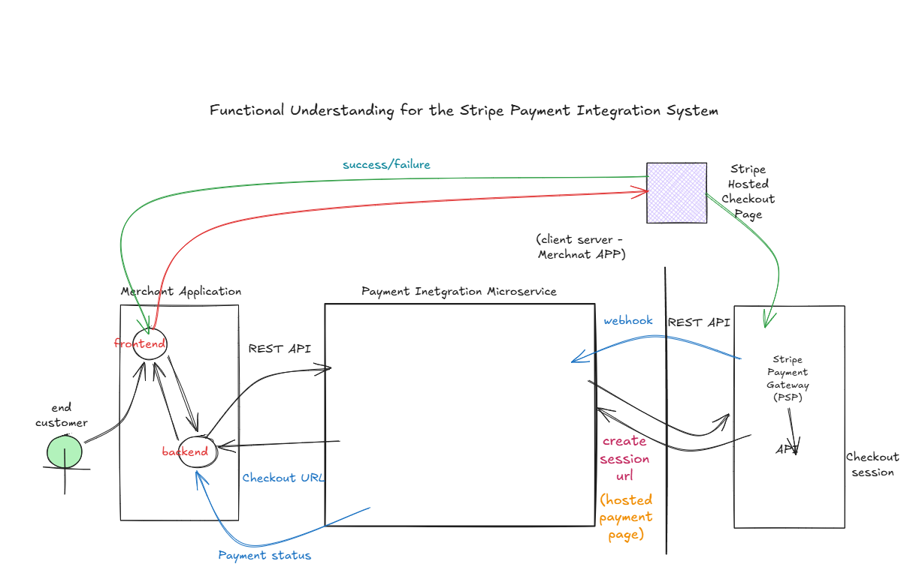

# Stripe Payment Integration System

A microservices-based payment integration system developed using **Java** and **Spring Boot** that integrates with the **Stripe Payment Gateway** for secure online payments.

The project demonstrates secure payment processing, request validation, HMAC authentication, business rule validation, and a modular microservices architecture.

---

## Project Overview

The Stripe Payment Integration System is a backend application built using Java and Spring Boot that simulates a real-world payment workflow. It validates incoming payment requests, applies business validation rules, and securely integrates with the Stripe Payment Gateway to create hosted checkout sessions.

The application follows a microservices architecture, where each service is responsible for a specific functionality, making the system modular, maintainable, and scalable.

---

## Key Highlights

- Microservices-based architecture
- Stripe Checkout Session integration
- HMAC SHA-256 request authentication
- Duplicate transaction validation
- Payment threshold validation
- Spring Security integration
- RESTful API development
- Flyway database migration

---

## System Architecture



---

## Payment Flow

1. Customer selects a product or service from the Merchant Application.
2. The Merchant Backend sends a payment request to the Validation Service.
3. The Validation Service verifies the HMAC signature.
4. Business validation rules are executed.
5. Duplicate transaction validation is performed.
6. Payment threshold validation is checked.
7. Valid requests are forwarded to the Create Session Integration Service.
8. The Create Session Integration Service communicates with Stripe APIs.
9. Stripe generates a Checkout Session.
10. The customer is redirected to the Stripe Hosted Checkout page.
11. After payment completion, Stripe returns the payment status to the Merchant Application.

---

## Repository Structure

```
Stripe-Payment-Integration-System
│
├── docs
│   └── architecture.png
│
├── create-session-integration
│
├── validation-service-validator
│
└── README.md
```

---

## Microservices

### 1. Create Session Integration

Responsible for:

- Creating Stripe Checkout Sessions
- Integrating with Stripe APIs
- Generating Hosted Checkout URLs
- REST API implementation
- Global exception handling

**Technologies Used**

- Spring Boot
- Spring Web
- Stripe Java SDK
- Maven

---

### 2. Validation Service Validator

Responsible for validating payment requests before forwarding them to the Stripe service.

**Features**

- HMAC SHA-256 Signature Validation
- Duplicate Transaction Validation
- Payment Threshold Validation
- Merchant Request Validation
- Spring Security
- Business Rule Validation
- Database-driven Validation Rules

---

## Features

- Microservices Architecture
- Stripe Payment Gateway Integration
- Secure REST APIs
- Spring Security
- HMAC Authentication
- Business Rule Validation
- Duplicate Transaction Detection
- Flyway Database Migration
- Layered Architecture
- Global Exception Handling
- Maven Build System

---

## Technology Stack

| Technology | Description |
|------------|-------------|
| Java 21 | Programming Language |
| Spring Boot | Backend Framework |
| Spring Web | REST API Development |
| Spring Security | Authentication & Authorization |
| Maven | Build Tool |
| MySQL | Relational Database |
| Flyway | Database Migration |
| Stripe Java SDK | Payment Gateway Integration |
| Git | Version Control |
| GitHub | Source Code Management |

---

## Validation Flow

```
Merchant Application
        │
        ▼
Validation Service
        │
        ▼
HMAC Signature Validation
        │
        ▼
Business Rule Validation
        │
        ▼
Duplicate Transaction Validation
        │
        ▼
Payment Threshold Validation
        │
        ▼
Create Session Integration Service
        │
        ▼
Stripe Checkout Session
```

---

## Security

The project implements multiple security mechanisms including:

- HMAC SHA-256 Authentication
- Request Signature Validation
- Spring Security Filter Chain
- Global Exception Handling

---

## Database

The Validation Service stores:

- Merchant Payment Requests
- Validation Rules
- Duplicate Transaction Records

Database schema migrations are managed using **Flyway**.

---

## REST APIs

### Create Stripe Checkout Session

**Endpoint**

```
POST /payment/create-session
```

**Sample Request**

```json
{
  "merchantId": "M1001",
  "transactionId": "TXN001",
  "amount": 1000,
  "currency": "INR"
}
```

**Sample Response**

```json
{
  "status": "SUCCESS",
  "checkoutUrl": "https://checkout.stripe.com/..."
}
```

---

## Prerequisites

Before running the project, ensure the following software is installed:

- Java 21
- Maven 3.9+
- MySQL 8+
- Git
- Stripe Test Account

---

## Getting Started

### Clone Repository

```bash
git clone https://github.com/shitalpatle04/Stripe-Payment-Integration-System.git
```

### Navigate to a Microservice

```bash
cd create-session-integration
```

or

```bash
cd validation-service-validator
```

### Build the Project

```bash
mvn clean install
```

### Run the Application

```bash
mvn spring-boot:run
```

---

## Configuration

Before running the application, configure the following properties:

- MySQL Database URL
- Database Username
- Database Password
- Stripe Secret Key
- HMAC Secret Key

Example:

```properties
stripe.secret.key=${STRIPE_SECRET_KEY}
hmac.secret.key=${HMAC_SECRET_KEY}
```

---

## Learning Outcomes

This project helped me gain practical experience in:

- Java Backend Development
- Spring Boot
- REST API Development
- Microservices Architecture
- Stripe Payment Gateway Integration
- Spring Security
- HMAC Authentication
- Business Rule Validation
- Flyway Database Migration
- Git and GitHub

---

## Future Enhancements

- Spring Cloud Config Server
- API Gateway
- Service Discovery
- Docker Containerization
- Kubernetes Deployment
- Redis Caching
- Kafka Integration
- CI/CD Pipeline
- Monitoring and Logging

---

## Author

**Shital Patle**

Backend Developer | Java | Spring Boot | REST APIs | Microservices

GitHub: https://github.com/shitalpatle04

---
